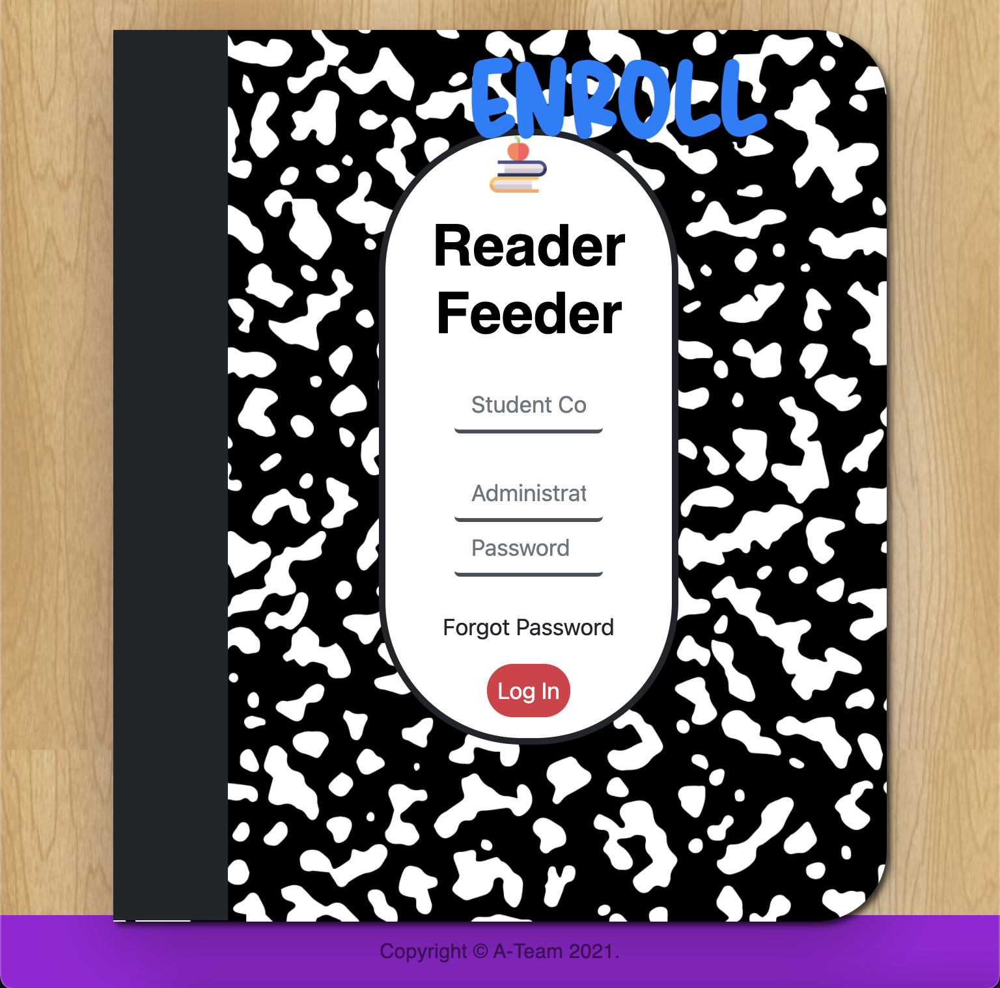

# Reader Feeder

We created an application to incentivize kids to read more books by offering them rewards for completing a certain number of books read in a predefined period.

## Deployment

Project deployed to Heroku

[Reader Feeder](https://readerfeeder.herokuapp.com/)

## Screenshot

## License

[MIT](https://choosealicense.com/licenses/mit/)

## Authors

- [@grider27](https://www.github.com/grider27)

- [@vinhkhamhuynh](https://www.github.com/vinhkhamhuynh)

- [@karizmatik215](https://www.github.com/karizmatik215)

- [@mikemarino](https://www.github.com/mikemarino)
